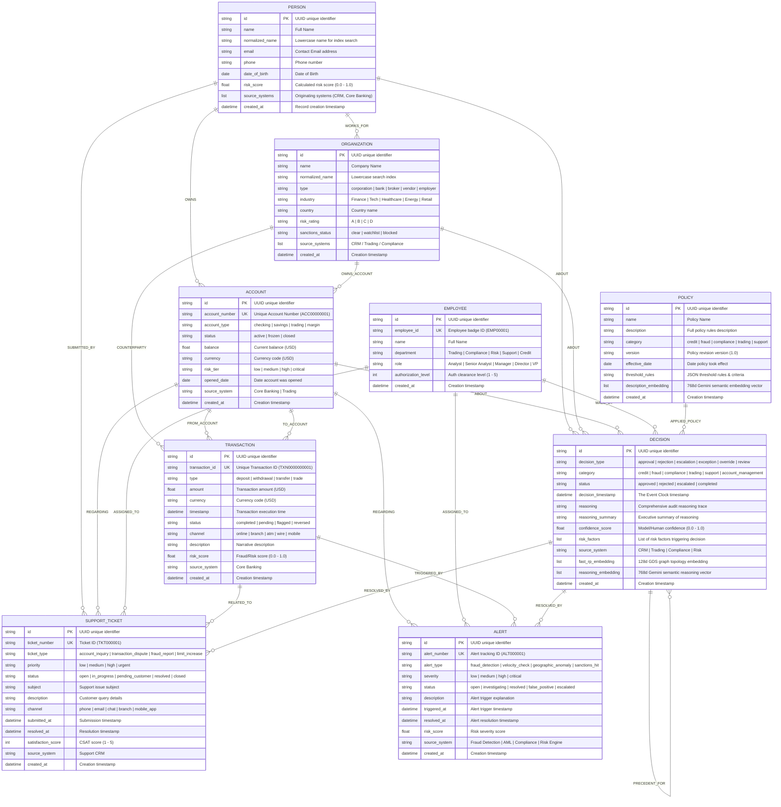
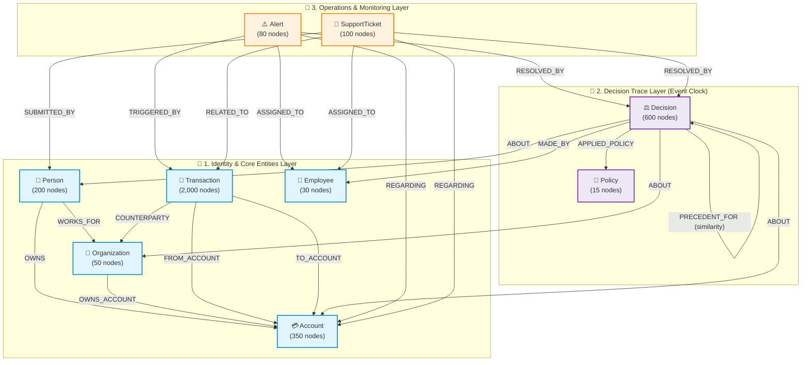

# Complete Database Entity-Relationship (ER) Diagram

This document contains the Entity-Relationship (ER) model and schema architecture for the **Context Graph** project, corresponding to the synthetic sample data generated by [`generate_sample_data.py`](file:///media/ashik-hegde/Drive2/5edi/context-graph-demo/backend/scripts/generate_sample_data.py) and stored in Neo4j.

---

## 1. Entity-Relationship (ER) Diagram

---

## 2. Graph Topology & Layer Architecture

---

## 3. Relationship Matrix & Cardinality Rules

| Source Node | Relationship Type | Target Node | Cardinality | Properties on Relationship | Description |
|:---|:---:|:---|:---:|:---|:---|
| `Person` | **`OWNS`** | `Account` | `1 : N` | *None* | Legal owner of financial account |
| `Person` | **`WORKS_FOR`** | `Organization` | `N : 1` | `role`, `start_date` | Employment relationship |
| `Organization` | **`OWNS_ACCOUNT`** | `Account` | `1 : N` | *None* | Corporate account ownership |
| `Transaction` | **`FROM_ACCOUNT`** | `Account` | `N : 1` | *None* | Debited source account |
| `Transaction` | **`TO_ACCOUNT`** | `Account` | `N : 1` | *None* | Credited destination account |
| `Transaction` | **`COUNTERPARTY`** | `Organization` | `N : 1` | *None* | External corporate counterparty |
| `Decision` | **`ABOUT`** | `Person` \| `Account` \| `Organization` | `N : N` | *None* | Target subject of the decision trace |
| `Decision` | **`MADE_BY`** | `Employee` | `N : 1` | *None* | Human agent who authored the decision |
| `Decision` | **`APPLIED_POLICY`** | `Policy` | `N : 1` | *None* | Institutional policy invoked |
| `Decision` | **`CAUSED`** | `Decision` | `N : N` | `confidence`, `causation_type` | Causal chain (direct/enabling cause) |
| `Decision` | **`INFLUENCED`** | `Decision` | `N : N` | `weight`, `influence_type` | Contextual / precedent influence |
| `Decision` | **`PRECEDENT_FOR`** | `Decision` | `N : N` | `similarity_score`, `outcome_relevance` | Historical precedent link |
| `Alert` | **`TRIGGERED_BY`** | `Transaction` | `N : 1` | *None* | Suspicious transaction triggering alert |
| `Alert` | **`REGARDING`** | `Account` | `N : 1` | *None* | Subject account under monitoring |
| `Alert` | **`ASSIGNED_TO`** | `Employee` | `N : 1` | *None* | Investigator or analyst |
| `Alert` | **`RESOLVED_BY`** | `Decision` | `N : 1` | *None* | Resolution decision audit link |
| `SupportTicket` | **`SUBMITTED_BY`**| `Person` | `N : 1` | *None* | Customer filing the request |
| `SupportTicket` | **`REGARDING`** | `Account` | `N : 1` | *None* | Account referenced in dispute/inquiry |
| `SupportTicket` | **`RELATED_TO`** | `Transaction` | `N : 1` | *None* | Disputed financial transaction |
| `SupportTicket` | **`ASSIGNED_TO`** | `Employee` | `N : 1` | *None* | Support rep handling ticket |
| `SupportTicket` | **`RESOLVED_BY`** | `Decision` | `N : 1` | *None* | Formal outcome decision |

---

## 4. Vector & Graph Embedding Indexes

| Index Name | Target Label | Target Property | Dimensions | Metric / Algorithm | Purpose |
|:---|:---|:---|:---:|:---|:---|
| `decision_reasoning_idx` | `:Decision` | `reasoning_embedding` | **768** | Cosine (`text-embedding-004`) | Semantic similarity search over decision justifications |
| `policy_description_idx` | `:Policy` | `description_embedding` | **768** | Cosine (`text-embedding-004`) | Semantic search across compliance & credit policies |
| `decision_fastrp_idx` | `:Decision` | `fastrp_embedding` | **128** | Cosine (FastRP Graph Embedding) | Structural topology similarity in the causal graph |
| `person_fastrp_idx` | `:Person` | `fastrp_embedding` | **128** | Cosine (FastRP Graph Embedding) | Entity resolution & community pattern discovery |
| `account_fastrp_idx` | `:Account` | `fastrp_embedding` | **128** | Cosine (FastRP Graph Embedding) | Fraud ring and high shared transaction detection |
